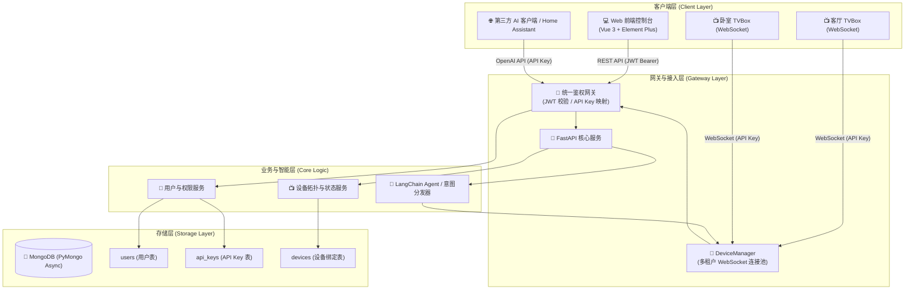

# 📺 TVBox AI 控制中心 (TvBoxServer)

<p align="center">
  
  
  
  
  
  
</p>

**TvBoxServer** 是专为 Android TVBox / 智能电视打造的 **多租户 AI 控制中心**。基于 FastAPI、LangChain 与 Vue 3 构建，支持双向 WebSocket 设备长连接与自然语言意图调度，并提供 **兼容 OpenAI 格式的标准 API**，让任意大语言模型或智能助手无缝化身为家庭智能电视管家。

---

## ✨ 核心特性

- 🤖 **智能自然语言控制**：内置 LangChain / LLM Agent 意图识别与工具调用（Function Calling），支持影视搜索点播、遥控器键值模拟、播放进度跳转、音量控制与应用唤醒等多种场景。
- 🔌 **兼容 OpenAI API 协议**：提供标准的 `/v1/models` 和 `/v1/chat/completions` 接口，可直接接入 NextChat、ChatBox、Dify、Home Assistant 等第三方客户端及各类自动化工作流。
- 🛡️ **双链路安全鉴权体系**：
  - **平台管理链路 (JWT)**：Web 控制台采用用户账号密码注册与登录，JWT Bearer 鉴权，保障控制台数据独立。
  - **设备交互链路 (用户级 API Key)**：TVBox 终端与外部 OpenAI 接口仅使用用户动态 API Key，支持一键轮换、加盐哈希存储与安全脱敏，彻底隔离跨租户设备访问。
- 👥 **完善的多租户与权限隔离**：
  - **普通用户**：支持邀请码注册、多电视设备绑定、查看设备在线/离线状态、生成与重置 API Key、Web 端直观对话测试。
  - **系统管理员**：统筹管理全站用户状态、设备分布与在线拓扑、邀请码批量分发与审计控制。
- ⚡ **实时全双工长连接**：基于 WebSocket 协议实现毫秒级指令下发与 TVBox 状态上报，支持自动重连、心跳保活与异常熔断。
- 💻 **现代化响应式控制台**：基于 Vue 3 + TypeScript + Element Plus 构建，支持黑暗/明亮主题与自适应终端体验。
- 🧪 **开箱即用的模拟器与测试**：内置 `mock_tvbox.py` 电视盒子虚拟客户端与完备的自动化测试集，无需实体电视即可快速联调。

---

## 🏛️ 系统架构



---

## 📦 项目结构

```text
ai_tv_controller/
├── backend/                  # 后端 FastAPI 核心服务
│   ├── app/                  # 应用业务模块
│   │   ├── config.py         # 配置加载与环境变量定义
│   │   ├── dependencies.py   # FastAPI 依赖注入 (JWT & API Key 鉴权)
│   │   ├── platform_routes.py# 平台管理 API 路由 (/api/v1/*)
│   │   ├── repository.py     # MongoDB 异步数据访问层 & 内存兜底仓储
│   │   ├── schemas.py        # Pydantic 数据契约模型
│   │   └── security.py       # 密码哈希 (bcrypt) 与 JWT 生成校验
│   ├── server.py             # FastAPI 服务主入口 & OpenAI 兼容接口
│   ├── langchain_agent.py    # LangChain Agent 意图识别与指令调度
│   ├── mock_tvbox.py         # TVBox 设备端模拟器 (用于本地调试)
│   ├── requirements.txt      # 后端依赖清单
│   ├── Dockerfile            # 后端 Docker 构建文件
│   └── compose.yaml          # Docker Compose 一键编排
├── frontend/                 # 前端 Web 控制台 (Vue 3 + TS + Vite)
│   ├── src/                  # 前端源码
│   ├── package.json          # 前端依赖配置
│   └── vite.config.ts        # Vite 构建配置
├── docs/                     # 详细架构与系统设计文档
│   ├── system_architecture_design.md
│   └── frontend_architecture_design.md
└── README.md                 # 项目说明文档
```

---

## 🚀 快速开始

### 方式一：使用 Docker Compose 部署（推荐）

1. **克隆项目**
   ```bash
   git clone https://github.com/shuwei-ai/TvBoxServer.git
   cd TvBoxServer
   ```

2. **配置环境变量**
   在 `backend/` 目录下创建 `.env` 文件：
   ```bash
   cp backend/.env.example backend/.env # 或根据下方说明创建
   ```

   `.env` 基础示例配置：
   ```dotenv
   MONGO_URI=mongodb://mongodb:27017
   MONGO_DATABASE=tvbox_ai
   JWT_SECRET=your-random-32-byte-secret-key-change-it
   API_KEY_PEPPER=your-random-secret-pepper-change-it
   JWT_EXPIRE_MINUTES=1440
   
   # 初始管理员账号（初次启动生效）
   BOOTSTRAP_ADMIN_USERNAME=admin
   BOOTSTRAP_ADMIN_PASSWORD=AdminPassword123!
   
   # 大语言模型配置 (兼容 OpenAI 规范)
   OPENAI_API_KEY=sk-your-openai-or-deepseek-key
   OPENAI_BASE_URL=https://api.openai.com/v1
   LLM_MODEL=gpt-4o
   SERVER_PORT=8000
   ```

3. **启动容器**
   ```bash
   cd backend
   docker compose up -d --build
   ```

4. **访问服务**
   打开浏览器访问 [http://127.0.0.1:8000](http://127.0.0.1:8000)，使用配置的管理员账号即可登录使用。

---

### 方式二：本地源码开发启动

#### 1. 启动后端 (Python 3.9+)

```bash
cd backend

# 安装依赖
python3 -m pip install -r requirements.txt

# 配置 .env 文件 (确保本地已运行 MongoDB)
# 启动 FastAPI 服务
python3 server.py
```

#### 2. 启动前端控制台 (Node.js 18+)

```bash
cd frontend

# 安装依赖
npm install

# 启动开发服务器
npm run dev
```

前端完成开发后，可通过以下命令一键构建并同步到后端的静态托管目录：
```bash
npm run build:backend
```

---

## 📱 TVBox 设备接入与模拟器测试

### 1. 设备接入流程
1. 登录 Web 控制台，进入 **设备管理** 页面。
2. 点击 **绑定新设备**，输入设备 ID（如 `tvbox_01`）和设备别名（如 `客厅电视`）。
3. 复制生成的 **用户级 API Key**（系统仅在首次绑定时明文展示一次）。
4. 在 TVBox 客户端中配置服务器地址与 API Key。

### 2. 使用 TVBox 模拟器联调
无需实体 Android 设备，项目自带 `mock_tvbox.py` 模拟真实电视盒子的 WebSocket 连接与指令响应：

```bash
# 环境变量指定设备 ID 与获取到的用户 API Key
export TVBOX_DEVICE_ID=tvbox_01
export TVBOX_API_KEY=sk-tvbox-your-user-api-key
export TVBOX_WS_URL=ws://127.0.0.1:8000/ws/v1/tvbox/tvbox_01

# 启动模拟器
python3 backend/mock_tvbox.py
```

---

## 🔗 核心 API 规范

### 1. 平台管理接口（Web 控制台，`Authorization: Bearer <JWT>`）
| 接口 | 方法 | 说明 |
| :--- | :--- | :--- |
| `/api/v1/auth/register` | `POST` | 用户注册（需邀请码） |
| `/api/v1/auth/login` | `POST` | 用户登录，获取 JWT Token |
| `/api/v1/devices` | `GET/POST` | 获取用户绑定的设备列表 / 绑定新设备 |
| `/api/v1/devices/{device_id}` | `DELETE` | 解绑电视设备 |
| `/api/v1/api-key` | `GET` | 查看当前用户的 API Key 状态（脱敏） |
| `/api/v1/api-key/reset` | `POST` | 轮换/重置当前用户的 API Key |
| `/api/v1/invite/my` | `GET` | 查询当前用户的可用邀请码 |
| `/api/v1/admin/*` | `*` | 管理员专属运维接口（用户启停、全局设备监控） |

### 2. 设备与智能体接口（`Authorization: Bearer <用户级 API Key>`）
| 接口 | 协议/方法 | 说明 |
| :--- | :--- | :--- |
| `/v1/models` | `GET` | 获取当前用户下的可用设备列表（格式兼容 OpenAI） |
| `/v1/chat/completions` | `POST` | 发送自然语言对话，Agent 智能调度控制电视 |
| `/ws/v1/tvbox/{device_id}` | `WebSocket` | TVBox 设备端长连接通道，用于指令下发与状态同步 |

---

## 🧪 测试与质量保证

项目内置全面的单元测试与静态语法检查：

```bash
# 运行单元测试套件
cd backend
python3 -m unittest discover -v

# 编译语法校验
python3 -m compileall -q app server.py langchain_agent.py mock_tvbox.py
```

---

## 📄 开源协议

本项目采用 [MIT License](LICENSE) 许可证开源。
