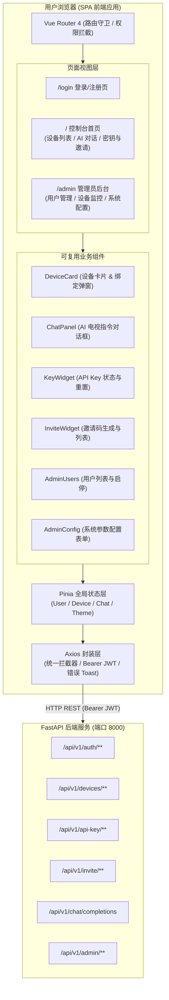
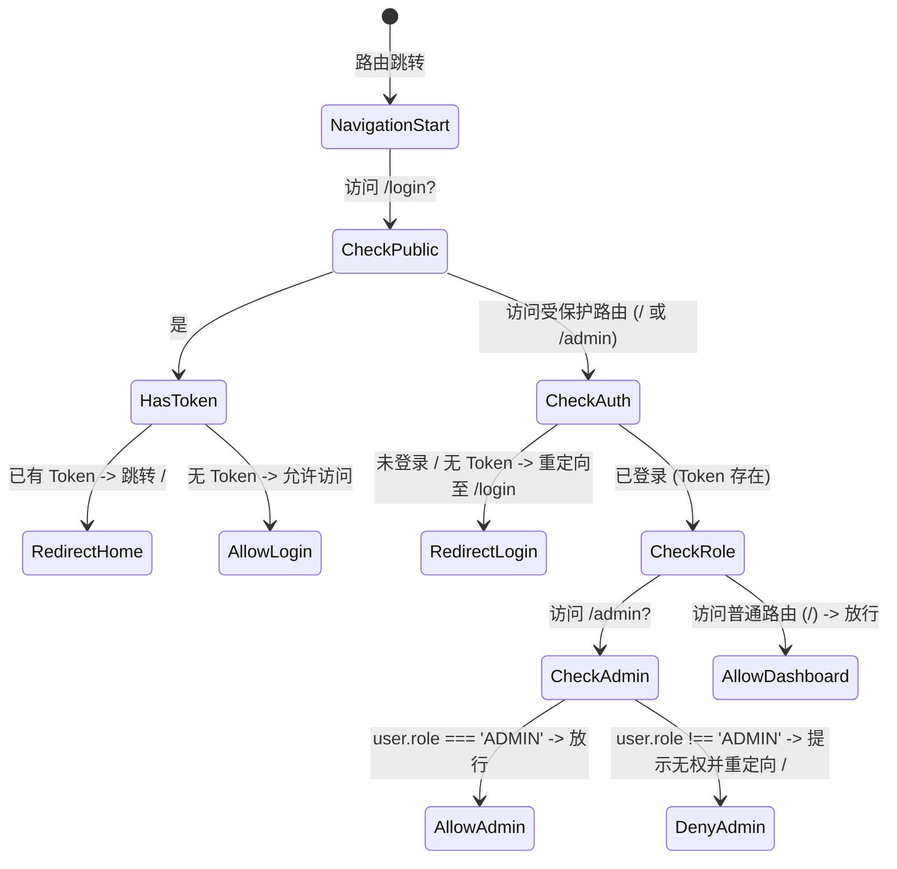

# TVBox AI 控制中心前端重构设计文档 (Vue 3 + TypeScript)

## 1. 概述与重构目标

### 1.1 背景与现状分析
当前 TVBox AI 控制中心前端采用单文件原生 HTML/JavaScript 架构（位于 `backend/static/index.html`）。随着系统全面升级为**多租户架构**，现存代码面临以下架构痛点：
- **缺乏组件化与状态管理**：所有 DOM 拼接、事件监听、API 调用与全局状态（`state.token`、`state.devices` 等）集中在单个脚本中，维护与扩展成本高。
- **缺乏静态类型检查**：接口出入参、实体模型（用户、设备、API Key、对话消息）无 TypeScript 类型约束，容易产生运行时错误。
- **路由与权限单一**：缺少真正的 SPA 路由机制与路由级权限守卫（如区分普通用户与管理员页面、登录失效重定向等）。
- **交互与视觉表现力受限**：缺乏成熟组件生态（表单校验、骨架屏、气泡弹窗、深浅色主题切换等）。

### 1.2 重构目标
采用现代前端主流技术栈 **Vue 3 + TypeScript + Vite + Pinia + Vue Router + Element Plus** 进行全面重构，达成以下目标：
1. **现代化单页面应用 (SPA)**：建立规范的路由体系与基于 JWT / 角色的全局路由守卫。
2. **严格的 TypeScript 类型体系**：为全部 API、数据模型、组件 Props/Emits 建立完整的类型定义。
3. **高内聚低耦合的组件化设计**：拆分认证、设备、AI对话、密钥管理、管理员控制台等独立功能组件。
4. **优质的视觉与交互体验**：默认采用深色科技感毛玻璃风格（Dark Mode），提供呼吸式在线状态反馈、优雅的聊天交互，并支持明暗主题切换。
5. **前后端解耦与便捷部署**：配置 Vite 开发代理与一键构建输出到 `backend/static/`，兼顾独立部署与单体托管需求。

---

## 2. 技术栈选型

| 技术层次 | 选型 | 版本/规范 | 说明 |
| :--- | :--- | :--- | :--- |
| **基础框架** | Vue 3 | `^3.4` | 使用 Composition API + `<script setup lang="ts">` |
| **开发语言** | TypeScript | `^5.4` | 严格模式 `strict: true`，完善的接口类型定义 |
| **构建工具** | Vite | `^5.2` | 极速热更新、模块化打包、灵活的开发代理 |
| **组件库** | Element Plus | `^2.7` | 现代化 UI 库，内置深色模式支持与完善的中文生态 |
| **图标库** | `@element-plus/icons-vue` | `^2.3` | Element Plus 官方矢量图标组件 |
| **状态管理** | Pinia | `^2.1` | 组合式 Store，全面支持 TypeScript 类型推导 |
| **路由管理** | Vue Router | `^4.3` | SPA 路由导航、路由懒加载与动态鉴权守卫 |
| **网络请求** | Axios | `^1.7` | 请求/响应拦截器、JWT 注入、统一错误处理与 401 登出 |
| **样式与主题** | CSS Variables + SCSS | - | 自定义深色科技暗黑主题 + 毛玻璃滤镜 + 响应式布局 |

---

## 3. 总体架构与数据流设计

### 3.1 架构拓扑图



### 3.2 目录结构规划

项目根目录下重命名原 `fronted/` 目录为 `frontend/`：

```
ai_tv_controller/
├── backend/                  # FastAPI 后端项目
│   ├── static/               # 静态资源目录（构建产物输出目标）
│   └── ...
├── docs/                     # 设计文档目录
│   ├── system_architecture_design.md
│   └── frontend_architecture_design.md
└── frontend/                 # [NEW] Vue 3 + TS 前端工程
    ├── public/               # 公共静态资源 (favicon, logo 等)
    ├── src/
    │   ├── api/              # API 请求函数模块化封装
    │   │   ├── auth.ts       # 登录、注册、用户信息
    │   │   ├── devices.ts    # 设备查询、绑定、解绑
    │   │   ├── apiKey.ts     # API Key 状态与重置
    │   │   ├── invite.ts     # 邀请码生成与查询
    │   │   ├── chat.ts       # AI 对话控制接口
    │   │   └── admin.ts      # 管理员系统配置、用户列表、系统邀请码
    │   ├── assets/           # 静态资源与全局样式
    │   │   ├── styles/
    │   │   │   ├── main.css  # 核心样式、暗黑主题变量、毛玻璃卡片
    │   │   │   └── variables.css
    │   ├── components/       # 业务组件
    │   │   ├── HeaderNav.vue # 顶部导航栏 (用户信息、暗黑切换、刷新、退出)
    │   │   ├── DeviceList.vue# 设备列表与绑定/解绑
    │   │   ├── BindDeviceDialog.vue # 绑定设备弹窗
    │   │   ├── ChatController.vue   # AI 电视控制对话面板
    │   │   ├── ApiKeyCard.vue       # API Key 状态与重置弹窗
    │   │   ├── InviteCodesCard.vue  # 个人邀请码卡片
    │   │   └── admin/               # 管理员专有组件
    │   │       ├── UserTable.vue    # 用户列表与启停操作
    │   │       ├── DeviceMonitor.vue# 系统设备在线监控
    │   │       ├── SystemConfig.vue # 系统限额与开关配置
    │   │       └── InviteGenerator.vue # 批量生成邀请码
    │   ├── layouts/          # 布局组件
    │   │   ├── MainLayout.vue# 包含 HeaderNav 的主要业务骨架
    │   │   └── BlankLayout.vue # 登录等全屏布局
    │   ├── router/           # 路由配置与鉴权守卫
    │   │   ├── index.ts
    │   │   └── guards.ts     # 登录状态检查与 ADMIN 权限守卫
    │   ├── stores/           # Pinia 状态管理
    │   │   ├── user.ts       # 用户信息、Token、角色、登录/登出
    │   │   ├── device.ts     # 设备列表、在线状态、当前选定设备
    │   │   ├── chat.ts       # 对话记录历史与发送状态
    │   │   └── theme.ts      # 明暗主题切换
    │   ├── types/            # TypeScript 接口与类型定义
    │   │   ├── api.d.ts      # 基础 Response<T> 结构
    │   │   ├── user.d.ts     # UserInfo, Role, AuthResponse
    │   │   ├── device.d.ts   # DeviceItem, BindDeviceParams
    │   │   ├── chat.d.ts     # ChatMessage, ChatCompletionParams
    │   │   └── admin.d.ts    # SystemConfig, AdminUserItem
    │   ├── utils/            # 工具库
    │   │   ├── request.ts    # Axios 实例及拦截器
    │   │   └── storage.ts    # localStorage 封装
    │   ├── App.vue           # 根组件
    │   └── main.ts           # 应用入口
    ├── index.html            # 页面入口模板
    ├── package.json          # 依赖与脚本
    ├── tsconfig.json         # TypeScript 配置
    └── vite.config.ts        # Vite 开发与打包配置
```

---

## 4. 路由与权限设计

### 4.1 页面路由表

| 路由路径 | 页面组件 | 访问权限 | 描述 |
| :--- | :--- | :--- | :--- |
| `/login` | `Login.vue` | 公开 | 用户登录 / 注册（支持邀请码输入） |
| `/` | `Dashboard.vue` | 需登录 (`USER` / `ADMIN`) | 核心控制台：设备管理、AI 控制、API Key、邀请码 |
| `/admin` | `AdminConsole.vue` | 需管理员 (`ADMIN`) | 管理员控制台：用户管控、全局设备、系统参数配置 |
| `/:pathMatch(.*)*` | `NotFound.vue` | 公开 | 404 页面 |

### 4.2 路由守卫与鉴权状态机



---

## 5. 核心模块与功能设计

### 5.1 认证模块 (`Auth`)
- **登录 / 注册切换**：通过 Tab 切换登录与注册表单。
- **注册防呆与邀请码**：当切换到注册模式时，显示邀请码输入框；表单包含用户名（长度≥3）、密码（长度≥8）基础校验。
- **持久化与响应**：登录/注册成功后，保存 JWT Token 与 User 信息至 `localStorage`，并在 Pinia `userStore` 中更新状态，自动重定向至首页。

### 5.2 设备管理模块 (`Device`)
- **设备列表展示**：
  - 设备名称、设备 ID（`device_id`）、绑定时间。
  - 在线状态标识：通过绿色呼吸灯（在线）或灰色状态灯（离线）直观展示。
  - 默认设备徽标（`is_default`）。
- **设备绑定**：点击 `+ 绑定设备` 弹出对话框，输入设备 ID 与设备名称；若后端返回新生成的 `api_key`，立即触发弹窗提示用户保存。
- **设备解绑**：危险操作确认弹窗，确认后调用 `DELETE /api/v1/devices/{id}` 并刷新列表。

### 5.3 AI 电视控制对话模块 (`Chat`)
- **目标设备路由**：下拉框支持选择“自动路由 (`auto`)”或指定名下的某台在线/离线电视设备。
- **对话记录流**：
  - 用户发送指令气泡（靠右，主题色高亮）。
  - AI 响应气泡（靠左，深色卡片风格，展示 LLM 生成的动作反馈或执行结果）。
  - 错误提示气泡（红色高亮，便于调试排查）。
- **加载状态**：发送指令时输入框禁用并显示 Loading 动画，完成后自动滚动至消息底部。

### 5.4 用户级 API Key 与邀请码模块 (`Key & Invite`)
- **API Key 卡片**：
  - 展示 Key 状态（`ACTIVE` / `REVOKED`）与脱敏前缀（如 `tvbox_live_a1b2••••••••`）。
  - “重置 API Key”按钮：二次警告确认后调用重置接口，弹出全屏复制弹窗。
- **我的邀请码卡片**：
  - 展示当前用户已生成的邀请码列表与使用状态（`UNUSED` / `USED`）。
  - “生成邀请码”按钮：一键生成并自动加入列表。

### 5.5 管理员控制台 (`Admin`)
仅对 `user.role === 'ADMIN'` 开放：
- **全局概览指标**：展示系统注册人数/上限、设备总量、在线设备总数。
- **用户管理表格**：展示用户名、角色、名下设备数、账号状态（启用/禁用），支持一键启停用户。
- **系统参数配置**：
  - 开放注册开关 (`allow_user_registration`)
  - 强制邀请码开关 (`require_invite_code`)
  - 用户总数上限 (`max_registered_users`)
  - 单用户设备上限 (`max_devices_per_user`)
  - 单用户邀请码上限 (`max_invites_per_user`)
- **系统邀请码批量生成**：支持输入生成数量（1~20），生成后自动写入剪贴板。

---

## 6. 前后端接口契约 (API Specification)

所有接口统一基于 `/api/v1/`，请求头携带 `Authorization: Bearer <JWT_TOKEN>`。

| 分组 | 路径 | 方法 | 请求体 / 参数 | 返回数据 `data` 结构 |
| :--- | :--- | :---: | :--- | :--- |
| **Auth** | `/api/v1/auth/login` | `POST` | `{ username, password }` | `{ access_token, user: { id, username, role, status } }` |
| **Auth** | `/api/v1/auth/register` | `POST` | `{ username, password, invite_code? }` | `{ access_token, user: { ... } }` |
| **Auth** | `/api/v1/auth/me` | `GET` | 无 | `{ user: { ... } }` |
| **Device** | `/api/v1/devices` | `GET` | 无 | `{ devices: DeviceItem[], api_key: ApiKeyInfo }` |
| **Device** | `/api/v1/devices/bind` | `POST` | `{ device_id, device_name }` | `{ device: DeviceItem, api_key?: string }` |
| **Device** | `/api/v1/devices/{device_id}`| `DELETE`| 路径参数 | `{ success: true, message }` |
| **API Key** | `/api/v1/api-key/reset`| `POST` | 无 | `{ api_key: string, prefix: string }` |
| **Invite** | `/api/v1/invite/my-codes`| `GET` | 无 | `{ codes: InviteItem[] }` |
| **Invite** | `/api/v1/invite/generate`| `POST` | 无 | `{ code: string, status: string }` |
| **Chat** | `/api/v1/chat/completions`| `POST` | `{ model, device_id, messages, stream }` | `{ choices: [{ message: { content } }] }` |
| **Admin** | `/api/v1/admin/users` | `GET` | 无 | `{ users: AdminUserItem[] }` |
| **Admin** | `/api/v1/admin/users/{id}/status`| `PUT` | `{ status: 0 \| 1 }` | `{ success: true }` |
| **Admin** | `/api/v1/admin/devices` | `GET` | 无 | `DeviceItem[]` |
| **Admin** | `/api/v1/admin/system/config`| `GET` | 无 | `SystemConfig` |
| **Admin** | `/api/v1/admin/system/config`| `PUT` | `SystemConfig` | `{ success: true }` |
| **Admin** | `/api/v1/admin/invite/generate` | `POST` | `{ count: number }` | `{ codes: string[] }` |

---

## 7. 视觉规范与主题系统 (Design Tokens)

### 7.1 色彩与质感
- **主背景 (`--bg`)**: `#07111f` (暗黑深邃夜空渐变，辅以顶部微光径向渐变)
- **卡片面板 (`--panel`)**: `rgba(16, 29, 45, 0.88)` (高质感毛玻璃 Backdrop Filter)
- **边框与分割线 (`--line`)**: `rgba(37, 54, 75, 0.8)`
- **主要文字 (`--text-primary`)**: `#edf4ff`
- **次要文字 (`--text-muted`)**: `#94a3b8`
- **科技高亮色 (`--accent`)**: `#5eead4` (霓虹薄荷绿)
- **辅助强调色 (`--blue`)**: `#60a5fa` (科技蓝)
- **状态高亮色**: 
  - 成功/在线: `#34d399` (带外发光 `box-shadow: 0 0 10px #34d399`)
  - 危险/离线: `#fb7185`

### 7.2 交互动效
- **呼吸灯动效 (`breathing-dot`)**：电视设备在线状态采用 CSS 关键帧动画模拟呼吸外发光。
- **平滑过渡**：所有卡片 Hover、按钮交互、弹窗出现均使用 `transition: all 0.25s cubic-bezier(0.4, 0, 0.2, 1)`。

---

## 8. 构建与部署方案

### 8.1 Vite 代理配置 (`vite.config.ts`)
```typescript
export default defineConfig({
  plugins: [vue()],
  server: {
    port: 5173,
    proxy: {
      '/api': {
        target: 'http://127.0.0.1:8000',
        changeOrigin: true
      },
      '/v1': {
        target: 'http://127.0.0.1:8000',
        changeOrigin: true
      }
    }
  },
  build: {
    outDir: '../backend/static',
    emptyOutDir: true
  }
})
```

### 8.2 单体托管与独立部署
- **单体托管模式**：执行 `npm run build`，编译产物自动输出至 `backend/static/`，FastAPI 直接挂载并在访问根路径时托管最新前端。
- **独立部署模式**：产物输出至 `frontend/dist/`，配合 Nginx 反向代理将 `/api/` 指向 FastAPI 后端集群。
