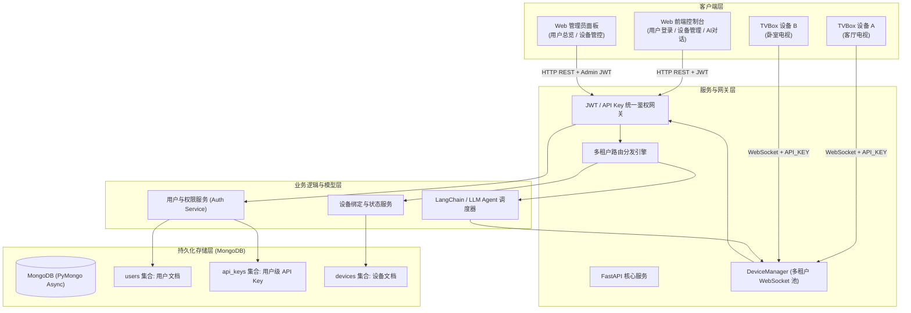
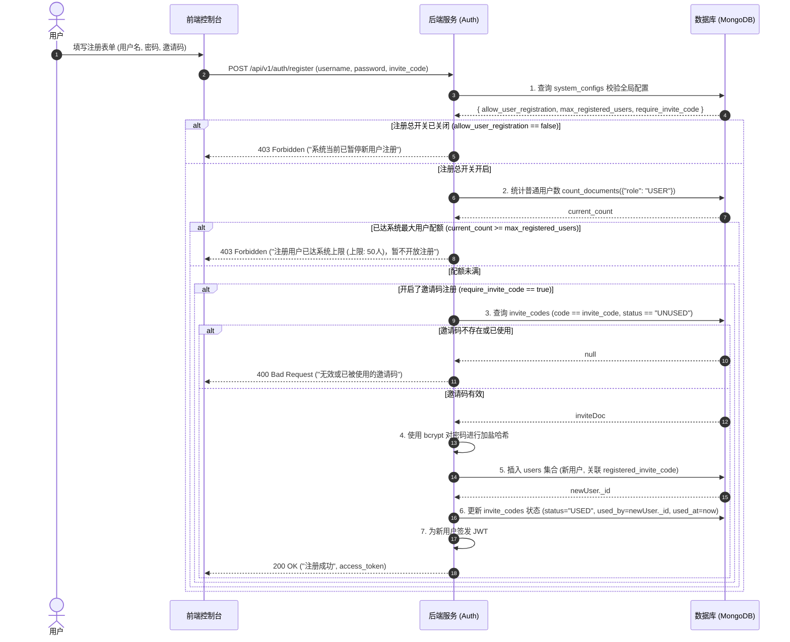
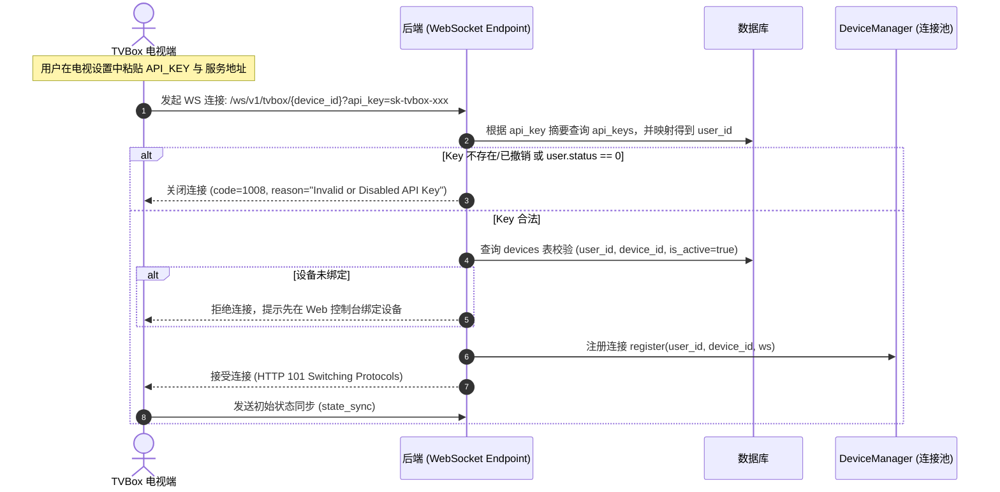
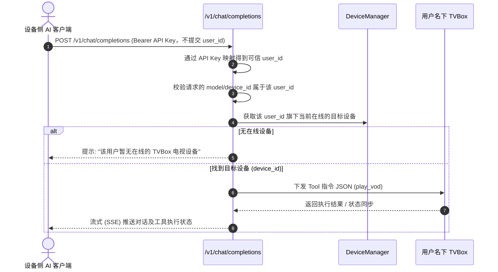

# TVBox AI 控制中心多租户与设备管理系统设计文档

## 1. 概述与背景

### 1.1 业务背景与鉴权机制转变
TVBox AI 控制中心目前具备：
- 通过 WebSocket 接入 Android TVBox 客户端建立双向长连接。
- 兼容 OpenAI 格式 API 与 Web 端交互，利用 LLM Agent / 规则引擎生成 Tool 控制电视。

**核心鉴权机制升级**：
> **重大原则变更**：彻底废弃原本基于系统环境变量 (`API_KEY=xxx`) 的全局单静态 Key 模式。系统采用两条独立鉴权链路：用户登录后颁发的 JWT 用于 Web 控制台及 `/api/v1/**` 平台管理接口；数据库动态生成的**用户级 API Key** 用于 TVBox WebSocket、`/v1/models` 和 `/v1/chat/completions`。一个用户级 API Key 可关联并访问该用户名下的多台设备，但不得访问其他用户的设备。

系统全面升级为**多租户平台级控制中心**，满足：
1. **用户注册与 JWT 登录**：用户注册后通过用户名、密码登录并获取 JWT；JWT 仅用于 Web 控制台及平台管理接口。
2. **用户级动态 API Key**：用户在控制台首次绑定设备时生成用户级 API Key；同一 Key 可供该用户名下多台 TVBox 使用。Key 重置后，该用户所有设备上的旧 Key 同时失效。
3. **设备绑定与接入**：用户先通过 JWT 在控制台绑定设备，再在电视端填入平台地址和用户级 API Key；WebSocket 只允许接入该用户已绑定的设备。
4. **多租户数据隔离**：`/v1/models` 根据 API Key 返回该用户名下设备；`/v1/chat/completions` 只能控制该用户名下被明确选择或按默认规则选中的设备。
5. **管理员运维能力**：管理员账号可统筹查看全部用户、API Key 状态与设备分布、连接状态及进行账号管控；默认不得查看 API Key 明文。

---

## 2. 总体架构与拓扑



---

## 3. MongoDB 数据模型与索引设计

本系统采用 **MongoDB** 作为主存储，在 Python/FastAPI 端使用 **PyMongo Async API** (`pymongo.AsyncMongoClient`) 实现异步非阻塞读写。

### 3.1 集合关系 (Collection Relationships)
```
┌──────────────────────────┐             1 : N             ┌────────────────────────────────────┐
│      users 集合          ├───────────────────────────────┤            devices 集合            │
│  - _id (ObjectId)        │                               │  - _id (ObjectId)                  │
│  - username (Unique)     │ ◀─── [user_id: ObjectId] ──── │  - user_id (Ref User)              │
│  - password_hash(bcrypt) │                               │  - device_id (Hardware ID)         │
│  - role ("USER"/"ADMIN") │                               │  - device_name                     │
│  - status (1/0)          │                               └────────────────────────────────────┘
└────────────┬─────────────┘
             │ 1 : N (最大3个)
             ▼
┌──────────────────────────┐
│   invite_codes 集合      │
│  - code (Unique)         │
│  - created_by (User Ref) │
│  - status ("UNUSED"/"USED")
│  - used_by (User Ref)    │
└──────────────────────────┘

users 1 : N api_keys（当前默认每用户一个有效 Key，模型允许后续扩展多个 Key）
```

### 3.2 集合文档结构 (Document Schemas)

#### 1. 用户集合 (`users`)
**安全设计规范**：
- **密码密文安全**：严禁明文存储密码，统一采用 **`bcrypt`（Passlib CryptContext, rounds=12）** 进行强加盐不可逆哈希存储。

**文档结构示例**：
```json
{
  "_id": ObjectId("66be1a8f9c1d2e3f4a5b6c7d"),
  "username": "user123",
  "password_hash": "$2b$12$e8Yk1m7Gj89Pqk20zH...sLq02a", // bcrypt不可逆加盐密文
  "role": "USER",                  // "USER" (普通用户) 或 "ADMIN" (管理员)
  "registered_invite_code": "INV-A8B9C0D1", // 注册所使用的邀请码
  "status": 1,                     // 1: 正常, 0: 封禁/禁用
  "created_at": ISODate("2026-08-15T10:00:00Z"),
  "updated_at": ISODate("2026-08-15T10:00:00Z")
}
```

**索引规划 (`users` Indexes)**：
- `{"username": 1}`，`unique=True`（防止用户名重复）

---

#### 2. 邀请码集合 (`invite_codes`)
**业务规则**：
- 每个普通用户最多可生成 **3 个**专属邀请码，用于邀请他人注册。
- 管理员可不受限批量生成系统邀请码（用于冷启动或官方分发）。
- 邀请码一经使用即标记为 `USED`，记录使用者与使用时间。

**文档结构示例**：
```json
{
  "_id": ObjectId("66be1c019c1d2e3f4a5b6c80"),
  "code": "INV-7F8E9D2C",                              // 唯一邀请码 (8~12位强随机英数串)
  "created_by": ObjectId("66be1a8f9c1d2e3f4a5b6c7d"), // 邀请码生成者 _id
  "status": "UNUSED",                                  // "UNUSED" (未激活) 或 "USED" (已使用)
  "used_by": null,                                     // 使用该码注册的用户 _id (已使用时写入)
  "used_at": null,                                     // 使用时间
  "created_at": ISODate("2026-08-15T19:00:00Z")
}
```

**索引规划 (`invite_codes` Indexes)**：
- `{"code": 1}`，`unique=True`（邀请码唯一索引，加速注册核销）
- `{"created_by": 1}`（查询某用户已生成的邀请码总数及明细，限制每人最大 3 个）

---

#### 3. 用户 API Key 集合 (`api_keys`)
**安全设计规范**：
- API Key 是用户级凭证，可访问该用户名下的多台设备，不属于某一台设备。
- 使用 `secrets.token_urlsafe(32)` 等加密安全随机源生成，格式为 `sk-tvbox-<random>`。
- 明文只在创建或重置成功时返回一次；数据库保存 `key_prefix` 与 Key 的 HMAC-SHA-256 摘要，不保存可直接使用的明文。
- 重置或撤销 Key 后，旧 Key 必须立即拒绝新请求，并断开使用旧 Key 建立的现有 WebSocket。

```json
{
  "_id": ObjectId("66be1a9f9c1d2e3f4a5b6c7e"),
  "user_id": ObjectId("66be1a8f9c1d2e3f4a5b6c7d"),
  "name": "默认 API Key",
  "key_prefix": "sk-tvbox-8f92",
  "key_hash": "hmac-sha256-hex-digest",
  "status": "ACTIVE",
  "created_at": ISODate("2026-08-15T12:00:00Z"),
  "last_used_at": ISODate("2026-08-15T18:55:00Z"),
  "revoked_at": null
}
```

**索引规划 (`api_keys` Indexes)**：
- `{"key_hash": 1}`，`unique=True`（API Key 鉴权定位）
- `{"user_id": 1, "status": 1}`（查询用户当前有效 Key）
- 当前产品规则为每用户一个有效 Key；通过业务事务保证轮换时最多只有一个 `ACTIVE` Key。

---

#### 4. 设备集合 (`devices`)
**生成规则与安全约束**：
- 用户通过 JWT 在控制台输入 `device_id` 完成绑定；设备本身不保存 API Key。
- `device_id` 在全平台唯一，已归属其他用户的设备不得被重复绑定。
- 用户首次绑定设备且尚无有效 API Key 时，系统同时创建用户级 API Key；以后绑定的设备复用该用户级 Key。

**文档结构示例**：
```json
{
  "_id": ObjectId("66be1b2c9c1d2e3f4a5b6c7e"),
  "user_id": ObjectId("66be1a8f9c1d2e3f4a5b6c7d"), // 关联 users._id
  "device_id": "tvbox_qinl-360a_c9e765",           // 电视硬件唯一识别码
  "device_name": "客厅电视",                        // 用户自定义别名
  "is_active": true,                               // 是否有效
  "last_online_at": ISODate("2026-08-15T18:55:00Z"),
  "created_at": ISODate("2026-08-15T12:00:00Z")
}
```

**索引规划 (`devices` Indexes)**：
- `{"device_id": 1}`，`unique=True`（同一硬件设备只能归属一个用户）
- `{"user_id": 1}`（加速获取用户绑定的全部设备列表）

---

#### 5. 系统配置集合 (`system_configs`)
用于存储全平台运行参数与管理员运维策略：

**文档结构示例**：
```json
{
  "_id": "global_settings",
  "allow_user_registration": true,  // 全局注册总开关 (true: 开放注册, false: 暂停新用户注册，关闭后任何人都无法注册)
  "require_invite_code": true,      // 是否强制启用邀请码注册机制 (默认 true)
  "max_invites_per_user": 3,        // 每个普通用户最大可生成的邀请码数量 (默认 3 个)
  "max_registered_users": 50,       // 允许注册的最大普通用户总数 (管理员可动态修改)
  "max_devices_per_user": 5,        // 单用户最大允许绑定的设备数配额 (默认 5 台)
  "updated_at": ISODate("2026-08-15T19:00:00Z"),
  "updated_by": ObjectId("66be1a8f9c1d2e3f4a5b6c7d") // 操作管理员 _id
}
```

---

## 4. 关键业务流程设计

### 4.0 设备侧身份解析原则
- 设备侧请求只提交 API Key，不提交 `user_id`；服务端不得接受 query、header 或 body 中由客户端声明的 `user_id` 作为授权依据。
- 服务端通过 API Key 摘要查询 `api_keys`，映射得到可信的 `user_id`，再用该 `user_id` 过滤设备。
- 请求中的 `device_id` 或 OpenAI `model` 只用于在该用户名下选择目标设备，不能改变 API Key 映射出的用户身份。
- 所有设备查询都必须包含 `devices.user_id == api_key.user_id`，避免 IDOR 和跨租户访问。

### 4.1 用户注册 (邀请码核销 + 注册开关 + 配额校验)


### 4.2 TVBox 设备连接与鉴权 (WebSocket 握手)


### 4.3 智能控制与多租户设备路由


---

## 5. API 接口规格设计 (统一带 /v1 版本规范)

### 5.1 用户认证模块 (`/api/v1/auth`)

#### 1. 用户注册 (邀请码必填)
- **URL**: `POST /api/v1/auth/register`
- **Request Body**:
  ```json
  {
    "username": "user123",
    "password": "Password@123",
    "invite_code": "INV-7F8E9D2C"
  }
  ```
- **Response (200 OK - 注册成功并签发 JWT)**:
  ```json
  {
    "code": 0,
    "message": "注册成功",
    "data": {
      "user_id": "66be1a8f9c1d2e3f4a5b6c7d",
      "username": "user123",
      "access_token": "eyJhbGciOiJIUzI1NiIsInR5cCI6IkpXVCJ9...",
      "token_type": "bearer"
    }
  }
  ```
- **Error Response**:
  - `403 Forbidden`: `{"code": 40301, "message": "系统当前已暂停新用户注册，请联系管理员"}`
  - `403 Forbidden`: `{"code": 40302, "message": "系统注册人数已达上限，暂不开放注册"}`
  - `400 Bad Request`: `{"code": 40001, "message": "无效或已被使用的邀请码"}`
  - `400 Bad Request`: `{"code": 40002, "message": "用户名已存在"}`

#### 2. 用户登录
- **URL**: `POST /api/v1/auth/login`
- **Request Body**:
  ```json
  {
    "username": "user123",
    "password": "Password@123"
  }
  ```
- **Response (200 OK)**:
  ```json
  {
    "code": 0,
    "message": "登录成功",
    "data": {
      "access_token": "eyJhbGciOiJIUzI1NiIsInR5cCI6IkpXVCJ9...",
      "token_type": "bearer",
      "user": {
        "id": "66be1a8f9c1d2e3f4a5b6c7d",
        "username": "user123",
        "role": "USER"
      }
    }
  }
  ```

---

### 5.2 邀请码管理模块 (`/api/v1/invite`)

#### 1. 获取我的邀请码列表及配额
- **URL**: `GET /api/v1/invite/my-codes`
- **Headers**: `Authorization: Bearer <JWT>`
- **Response (200 OK)**:
  ```json
  {
    "code": 0,
    "data": {
      "max_invites": 3,
      "used_invites_count": 1,
      "remaining_quota": 2,
      "codes": [
        {
          "code": "INV-7F8E9D2C",
          "status": "USED",
          "used_by_username": "friend_a",
          "used_at": "2026-08-15T19:10:00Z",
          "created_at": "2026-08-15T18:00:00Z"
        },
        {
          "code": "INV-3A2B1C0D",
          "status": "UNUSED",
          "used_by_username": null,
          "used_at": null,
          "created_at": "2026-08-15T18:05:00Z"
        }
      ]
    }
  }
  ```

#### 2. 生成新邀请码 (每人最多生成 3 个)
- **URL**: `POST /api/v1/invite/generate`
- **Headers**: `Authorization: Bearer <JWT>`
- **Response (200 OK)**:
  ```json
  {
    "code": 0,
    "message": "邀请码生成成功",
    "data": {
      "code": "INV-5E6F7A8B",
      "remaining_quota": 1
    }
  }
  ```
- **Error Response**:
  - `400 Bad Request`: `{"code": 40003, "message": "您的邀请码生成数量已达上限 (最大 3 个)"}`

---

### 5.3 设备管理模块 (`/api/v1/devices`)

#### 1. 获取当前用户设备列表
- **URL**: `GET /api/v1/devices`
- **Headers**: `Authorization: Bearer <JWT>`
- **Response (200 OK)**:
  ```json
  {
    "code": 0,
    "data": [
      {
        "id": "66be1b2c9c1d2e3f4a5b6c7e",
        "device_id": "tvbox_qinl-360a_c9e765",
        "device_name": "客厅电视",
        "online": true,
        "current_activity": "HomeActivity",
        "ws_url": "ws://192.168.3.91:8000/ws/v1/tvbox/",
        "last_online_at": "2026-08-15T18:50:00Z"
      }
    ]
  }
  ```

#### 2. 添加/绑定设备（首次绑定时生成用户级 API Key）
- **URL**: `POST /api/v1/devices/bind`
- **Headers**: `Authorization: Bearer <JWT>`
- **Request Body**:
  ```json
  {
    "device_id": "tvbox_30b2ece5fc32368dbd642141fbe8a7e3",
    "device_name": "卧室电视"
  }
  ```
- **Response (200 OK)**:
  ```json
  {
    "code": 0,
    "message": "设备绑定成功",
    "data": {
      "id": "66be1b3f9c1d2e3f4a5b6c7f",
      "device_id": "tvbox_30b2ece5fc32368dbd642141fbe8a7e3",
      "device_name": "卧室电视",
      "api_key": "sk-tvbox-7a2e5d9c1b4f8a0e3c6d2f5a8e1b4c7d", // 仅用户首次生成 Key 时返回；已有 Key 时不返回
      "ws_url": "ws://192.168.3.91:8000/ws/v1/tvbox/"
    }
  }
  ```

#### 3. 重新生成当前用户的 API Key
- **URL**: `POST /api/v1/api-key/reset`
- **Headers**: `Authorization: Bearer <JWT>`
- **影响范围**：旧 Key 立即失效，并断开该用户名下所有使用旧 Key 建立的 WebSocket；所有设备都需更新为新 Key。
- **Response (200 OK)**:
  ```json
  {
    "code": 0,
    "message": "API Key 刷新成功",
    "data": {
      "new_api_key": "sk-tvbox-99bc112a0d1e44a7f8e3c2d1b5a9e0f2"
    }
  }
  ```

#### 4. 获取当前用户 API Key 状态
- **URL**: `GET /api/v1/api-key`
- **Headers**: `Authorization: Bearer <JWT>`
- **Response**：只返回 `key_prefix`、`status`、`created_at`、`last_used_at`，不返回完整 Key。

#### 5. 解绑设备
- **URL**: `DELETE /api/v1/devices/{id}`
- **Headers**: `Authorization: Bearer <JWT>`

> 设备列表接口不得返回完整 API Key，只返回 `key_prefix` 或脱敏值。完整 Key 仅在首次创建或重置成功时展示一次。

---

### 5.4 管理员模块 (`/api/v1/admin`) - 需 `role=ADMIN`

#### 1. 查看全部用户列表及各用户设备统计
- **URL**: `GET /api/v1/admin/users`
- **Headers**: `Authorization: Bearer <Admin_JWT>`
- **Response (200 OK)**:
  ```json
  {
    "code": 0,
    "data": {
      "total_users": 15,
      "users": [
        {
          "id": "66be1a8f9c1d2e3f4a5b6c7d",
          "username": "user123",
          "role": "USER",
          "registered_invite_code": "INV-A8B9C0D1",
          "status": 1,
          "device_count": 2,
          "online_device_count": 1,
          "invite_generated_count": 2,
          "created_at": "2026-08-15T10:00:00Z"
        }
      ]
    }
  }
  ```

#### 2. 管理员批量生成系统邀请码 (不受配额限制)
- **URL**: `POST /api/v1/admin/invite/generate`
- **Headers**: `Authorization: Bearer <Admin_JWT>`
- **Request Body**: `{"count": 5}` (生成数量 1~20)
- **Response (200 OK)**:
  ```json
  {
    "code": 0,
    "message": "成功生成 5 个系统邀请码",
    "data": {
      "codes": ["INV-A1B2C3D4", "INV-E5F6G7H8", "INV-J9K0L1M2", "INV-N3P4Q5R6", "INV-S7T8U9V0"]
    }
  }
  ```

#### 3. 查看全站所有邀请码及使用链路
- **URL**: `GET /api/v1/admin/invite/codes`
- **Headers**: `Authorization: Bearer <Admin_JWT>`
- **Response (200 OK)**:
  ```json
  {
    "code": 0,
    "data": {
      "total": 30,
      "used_count": 12,
      "unused_count": 18,
      "list": [
        {
          "code": "INV-7F8E9D2C",
          "created_by_username": "admin",
          "status": "USED",
          "used_by_username": "user123",
          "used_at": "2026-08-15T10:00:00Z",
          "created_at": "2026-08-15T09:00:00Z"
        }
      ]
    }
  }
  ```
#### 4. 查看全平台所有设备分布
- **URL**: `GET /api/v1/admin/devices`
- **Headers**: `Authorization: Bearer <Admin_JWT>`
- **Response (200 OK)**:
  ```json
  {
    "code": 0,
    "data": [
      {
        "device_id": "tvbox_qinl-360a_c9e765",
        "device_name": "客厅电视",
        "owner_username": "user123",
        "owner_user_id": "66be1a8f9c1d2e3f4a5b6c7d",
        "online": true,
        "current_activity": "HomeActivity",
        "last_online_at": "2026-08-15T18:55:00Z"
      }
    ]
  }
  ```

#### 5. 封禁/解封用户
- **URL**: `PUT /api/v1/admin/users/{user_id}/status`
- **Headers**: `Authorization: Bearer <Admin_JWT>`
- **Request Body**: `{"status": 0}` (0为禁用，1为启用)

#### 6. 获取系统全局配置 (包含注册配额、邀请码开关与统计)
- **URL**: `GET /api/v1/admin/system/config`
- **Headers**: `Authorization: Bearer <Admin_JWT>`
- **Response (200 OK)**:
  ```json
  {
    "code": 0,
    "data": {
      "max_registered_users": 50,
      "allow_user_registration": true,
      "require_invite_code": true,
      "max_invites_per_user": 3,
      "max_devices_per_user": 5,
      "current_registered_users": 15,
      "remaining_quota": 35
    }
  }
  ```

#### 7. 修改系统全局配置 (动态调整用户注册上限、开关及单人邀请配额)
- **URL**: `PUT /api/v1/admin/system/config`
- **Headers**: `Authorization: Bearer <Admin_JWT>`
- **Request Body**:
  ```json
  {
    "max_registered_users": 100,
    "allow_user_registration": true,
    "require_invite_code": true,
    "max_invites_per_user": 3,
    "max_devices_per_user": 5
  }
  ```
- **Response (200 OK)**:
  ```json
  {
    "code": 0,
    "message": "系统配置更新成功"
  }
  ```

---

### 5.5 电视控制核心接口改造

#### 1. `/v1/models` (动态模型/设备列表 - 严格按 API Key 隔离)
- **请求鉴权**：必须携带 `Authorization: Bearer <API_KEY>`；不接受客户端提交 `user_id`。仅在无法设置 Header 的兼容场景允许 query 参数，并确保网关和应用日志对其脱敏。
- **数据隔离规则 (核心要求)**：
  - 服务端根据 API Key 摘要查询 `api_keys`，映射出可信的 `user_id`。
  - **只查询并返回 `devices.user_id == api_key.user_id` 的设备列表及其在线状态**。
  - **严禁返回全量设备或其它用户的设备**，彻底实现多租户数据隔离。
  - API Key 无效或已撤销返回 `401`；用户被禁用返回 `403`；合法用户没有设备时返回空列表 `{"object": "list", "data": []}`。

#### 2. `/v1/chat/completions` (对话控制)
- **改造点**：
  - 提取请求携带的 API Key，通过数据库映射得到可信 `user_id`，请求不携带 `user_id`。
  - 请求中的 `model` 或 `device_id` 只作为设备选择条件；查询必须同时满足 `devices.user_id == api_key.user_id`。
  - 指定设备不属于该用户时返回 `404`；不得退化为全平台第一台在线设备。
  - 未指定设备时：仅一台在线设备则自动选择；多台在线设备则选择用户配置的默认设备，否则返回要求明确选择设备的错误。

#### 3. `/ws/v1/tvbox/{device_id}` (WebSocket 接入)
- **改造点**：
  - 连接时通过 header 或 query 中的 API Key 映射得到可信 `user_id`，客户端不提交 `user_id`。
  - 严格校验 `(user_id, device_id, is_active=true)`；设备未预先绑定则拒绝连接，不允许自动认领。
  - API Key 被重置/撤销、设备解绑或账号被禁用时，立即断开相应现有连接。
  - （*保持对 `/ws/tvbox/{device_id}` 的兼容重定向或别名支持*）

---

## 6. 前端 (UI) 交互规划
 
在 Web 控制台提供一站式管理与交互体验：

1. **未登录状态**：
   - 居中展示登录 / 注册对话框（支持输入用户名、密码及**邀请码**）。
   - 若系统关闭注册，注册表单自动禁用并展示“当前系统暂未开放注册”提示。
2. **已登录控制台**：
   - **顶部信息栏与邀请码抽屉**：
     - 当前用户级 **API Key** 的前缀、状态、创建时间和最后使用时间；完整 Key 只在首次创建或重置时弹窗展示并支持一键复制。
     - **我的邀请码管理**：展示当前已生成的邀请码列表、使用状态及“生成新邀请码 (剩余 X/3)”按钮，支持一键复制邀请码或邀请注册链接。
     - TVBox **服务端连接地址**：`ws://<Server_IP>:8000/ws/v1/tvbox/`（带一键复制）。
   - **设备管理抽屉 / 列表**：
     - 列出名下绑定的设备卡片，展示实时在线/离线徽标及当前页面状态；设备卡片不展示独立 API Key，因为同一用户的设备共用用户级 Key。
     - 支持快捷修改备注名（如“客厅”、“卧室”）。
     - 支持“+ 绑定新设备”快捷弹窗；用户首次绑定时生成用户级 API Key，后续新增设备继续关联同一用户级 Key。
   - **AI 对话交互区**：
     - 设备下拉框仅展示当前用户自己的设备，支持“自动路由”或指定设备。
   - **管理员专属管理控制台**（仅 `role=ADMIN` 可见）：
     - **全平台运营看板**：用户总数、设备总数、在线设备分布、各用户设备明细表格及账号启用/禁用开关。
     - **系统邀请码池**：管理员可批量生成系统邀请码并追踪全站邀请裂变链路。
     - **系统配额与安全设置**：可视化设置最大注册用户数（`max_registered_users`）、一键开启/暂停全局新用户注册通道。

---

## 7. 实施路线规划

| 阶段 | 任务目标 | 主要工作内容 |
| :--- | :--- | :--- |
| **Phase 1** | **MongoDB 数据库与数据建模** | 引入 PyMongo Async (`pymongo.AsyncMongoClient`) 与 `passlib[bcrypt]`，创建 `users`、`api_keys`、`invite_codes`、`devices`、`system_configs` 集合与唯一索引。 |
| **Phase 2** | **认证与邀请码接口 (/api/v1/auth & /api/v1/invite)** | 实现 `/api/v1/auth/*` 注册登录（集成 bcrypt 密文存储、邀请码核销、配额与注册开关校验）、`/api/v1/invite/*` 邀请码生成与列表查询。 |
| **Phase 3** | **设备绑定与用户级 Key 管理** | 实现 `/api/v1/devices/*` 绑定，实现用户级 API Key 的首次生成、摘要存储、一次性展示、重置与撤销。 |
| **Phase 4** | **WebSocket 与 AI 路由多租户改造 (/v1/models & /ws/v1/...)** | 改造 `DeviceManager` 支持按 `(user_id, device_id)` 管理连接；设备请求仅携带 API Key，后端映射 `user_id`，并改造 `/v1/models` 与 `/v1/chat/completions` 实现租户隔离。 |
| **Phase 5** | **管理员端 API (/api/v1/admin)** | 实现 `/api/v1/admin/users`、`/api/v1/admin/invite/*`、`/api/v1/admin/devices` 及 `/api/v1/admin/system/config` 系统配额与注册开关管理。 |
| **Phase 6** | **Web 前端界面升级** | 在 `index.html` 中集成注册邀请码输入、个人邀请码卡片、设备绑定抽屉及管理员全功能运营/配额设置面板。 |
