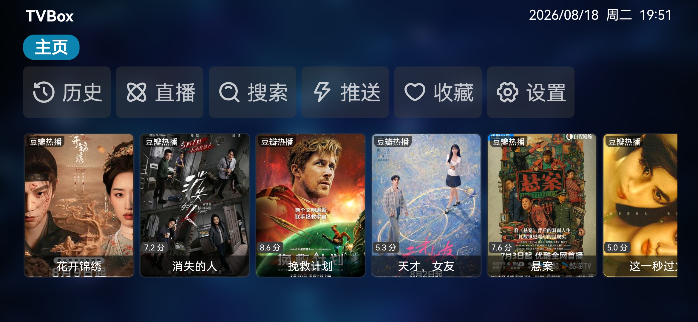
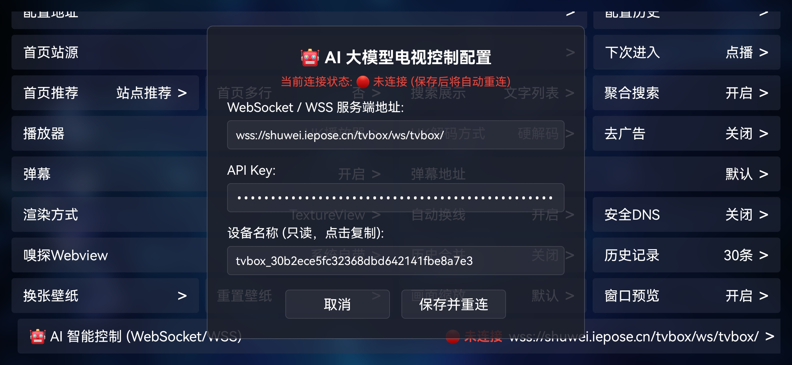
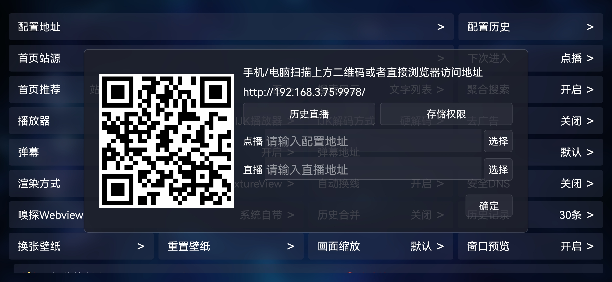
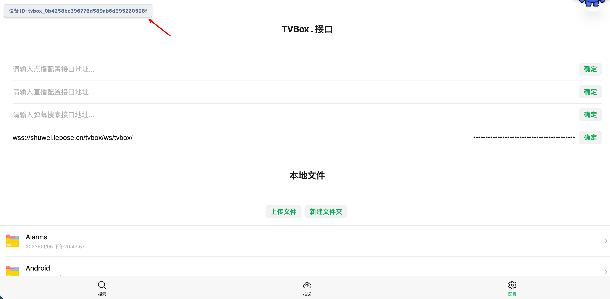
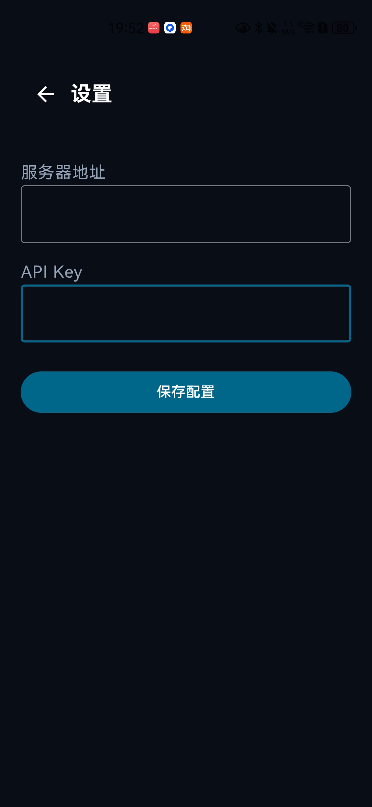

# 📺 TVBox AI 智能控制系统 - 设备连接与配置使用指南

本文档详细介绍如何下载安装 TVBox 电视端、手机语音遥控器端（TBC），以及如何在 Web 控制台完成设备绑定与参数配置，实现全套 AI 语音/文本大模型智能电视控制。

---

## 📥 一、客户端下载与准备工作

在开始配置前，请先下载并安装所需客户端：

| 客户端名称 | 说明 | 下载地址 |
| :--- | :--- | :--- |
| **TVBox 电视端** | 安装于 Android 智能电视 / 电视盒子 | [TVBoxOS Releases](https://github.com/shuwei-ai/TVBoxOS/releases) |
| **TBC 手机遥控器端** | 安装于 Android 手机，支持语音与按键遥控 | [TBC Releases](https://github.com/shuwei-ai/TBC/releases) |
| **Web 控制台** | 用于管理设备拓扑、生成 API Key、查看连接状态 | [TVBox AI 控制台](https://tvbox-frontend.pages.dev/) |

---

## 🔑 二、第一步：Web 控制台登录（微信扫码）与获取 API Key

1. **进入 Web 控制台**：
   打开浏览器访问 [TVBox AI 控制台](https://tvbox-frontend.pages.dev/)（或私有部署的 Web 控制台地址）。
2. **微信扫码免注册登录**：
   - **微信扫码**：打开手机微信「扫一扫」，扫描登录卡片上的小程序二维码。
   - **填写邀请码（首次登录）**：若为新用户首次使用，请点击展开 **「首次使用有邀请码？（点击展开）」**，输入管理员或老用户分发的**邀请码**（格式如 `INV-XXXXXXXX`）。
   - **手机确认授权**：在手机微信端点击【确认授权登录】，系统自动通过微信身份完成建档登录（无需手动填写账号密码），随后自动跳转进入控制台首页。
3. **添加设备与生成 API Key**：
   - 进入控制台左侧/顶部的 **「设备管理」** 页面，点击 **「绑定新设备」**。
   - 输入设备 ID（如 `tvbox_living_room`，可在电视端配置页查看）和设备别名（如 `客厅电视`）。
   - 绑定成功后，系统会为当前微信用户生成专属的 **用户级 API Key**（格式类似 `sk-tvbox-xxxxxxxx`）。
   > [!IMPORTANT]
   > API Key 仅在初次生成时明文展示一次，请及时复制并妥善保存。TVBox 电视端与手机遥控器端均需使用该 Key 进行身份鉴权。若丢失可在「API Key 管理」页面一键重置轮换。

---

## 📺 三、第二步：TVBox 电视端配置

### 1. 进入设置界面
启动电视上的 TVBox 应用，在首页右上角或侧边栏点击 **「设置」**。



---

### 2. 找到 AI 控制配置项
进入设置页面后，向下滚动至底部，找到并点击 **「AI大模型控制配置」**。



---

### 3. 配置服务器地址与 API Key
在 AI 控制配置页面中，可直接使用遥控器输入，或**使用手机浏览器扫描屏幕上的二维码**进入 Web 遥控配置页进行快速输入：



- **设备 ID**：页面顶部或二维码扫码页左上角显示的 ID（需与 Web 控制台绑定的设备 ID 一致）。
- **WebSocket 服务器地址**：
  ```text
  wss://shuwei.iepose.cn/tvbox/ws/tvbox
  ```
  *(如为自建私有服务器，填写对应的 `ws://` 或 `wss://` 服务端长连接地址)*
- **API Key**：填入在第一步中从 Web 控制台获取的 `sk-tvbox-...`。

扫码后在手机端配置界面如下（左上角可核对设备 ID）：



配置完成后保存并启用服务，电视端显示 **已连接** 即表示与 AI 控制服务打通。

---

## 📱 四、第三步：手机遥控器端 (TBC) 配置

1. 在手机上打开 **TBC (TVBox Controller)** 遥控器应用。
2. 点击右上角或设置入口，配置以下参数：



- **服务器地址**：
  ```text
  https://shuwei.iepose.cn/tvbox/
  ```
  *(注：自建服务请填写对应的 HTTP/HTTPS API 根地址，末尾需包含 `/`)*
- **API Key**：填入与 TVBox 端相同的用户级 API Key。
- **目标设备**：选择或输入需要控制的 TVBox 设备 ID。

配置完成后即可在手机端通过语音输入或虚拟按键向 TVBox 发送控制指令。

---

## 💬 五、第四步：使用与指令体验

配置完成后，您可以通过手机 TBC 语音、Web 控制台测试对话框、或接入第三方大模型客户端进行自然语言控制：

### 🎯 常用控制场景示例

- **影视搜索与播放**：“帮我播放狂飙第一集”、“我想看周星驰的功夫”
- **播放进度控制**：“快进到 10 分钟”、“倒退 30 秒”、“暂停播放”、“继续播放”
- **音量与系统控制**：“把声音调大一点”、“音量设为 50%”、“静音”
- **按键与界面导航**：“返回首页”、“打开设置”、“向下移动两格”、“确定”

---

## ❓ 六、常见问题排查 (FAQ)

### Q1: TVBox 电视端显示连接断开或无法连接？
- 检查电视网络连接是否通畅。
- 确认输入的 WebSocket 地址格式正确（以 `wss://` 或 `ws://` 开头）。
- 确认填写的 API Key 是否有效且未被重置。

### Q2: 遥控器发送指令电视无反应？
- 在 Web 控制台确认该设备当前是否在线（绿色状态）。
- 检查 TBC 遥控器填写的「服务器地址」末尾是否正确保留了 `/`。
- 确认 TBC 选中的「目标设备 ID」与当前电视配置的设备 ID 完全一致。

### Q3: 更换了 API Key 怎么办？
- 如果在 Web 控制台重置了 API Key，需同时在 **TVBox 电视端** 和 **手机 TBC 遥控器端** 更新为新 Key。